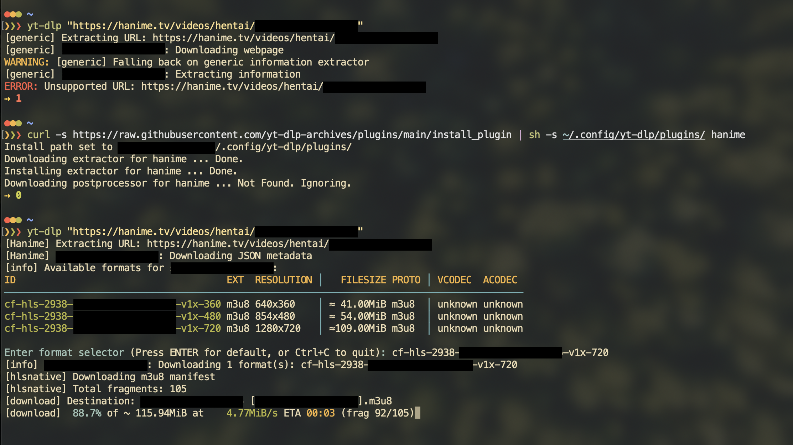

# YT-DLP Archieve Plugins
An archieve of all rejected and/or contriversial yt-dlp Plugin code for educational and example purposes.

# Rules
1. All Plugins must be working.
2. No Plugin should contain unnecessary/malicious code.
3. No code here should be used for nothing other than educational purposes AND ESPECIALLY NOT FOR PIRACY.
4. Have fun. 🗿

# How do I install *<plugin_name>* plugin?
## Install paths
According to the official YT-DL Plugin specifications, installing *<plugin_name>* plugin is as simple as putting the *<plugin_name>* folder in any of the following:
- `~/yt-dlp/plugins/` **(recommended on Linux/macOS)**
- `${XDG_CONFIG_HOME}/yt-dlp/plugins/`
- `${XDG_CONFIG_HOME}/yt-dlp-plugins/`
- `${APPDATA}/yt-dlp/plugins/` **(recommended on Windows)**
- `${APPDATA}/yt-dlp-plugins/`
- `~/.yt-dlp/plugins/`
- `~/yt-dlp-plugins/`
- `/etc/yt-dlp/plugins/`
- `/etc/yt-dlp-plugins/`\
The `<install_path>` placeholder in the next two segment is one of these.

## Automated install
```bash
curl -s https://raw.githubusercontent.com/yt-dlp-archives/plugins/main/install_plugin | sh -s <install_path> <plugin_name_1> <plugin_name_2> ...
```

## Mannual install
1. Clone this repo:
```bash
git clone https://github.com/yt-dlp-archives/plugins.git yt-dl_archive_plugins
```
2. Open the `yt-dl_archive_plugins` cloned above.
3. Open the `pluggables` folder in `yt-dl_archive_plugins`.
4. Copy the *<plugin_name>* folder into *<install_path>*.

# How do I add a new plugin?
1. Clone this repo and get into the directory:
```bash
git clone https://github.com/yt-dlp-archives/plugins.git yt-dl_archive_plugins
cd yt-dl_archive_plugins
```
2.
    1. If your plugin has an extractor:
    ```bash
    ./create_new_extractor.sh <name_of_your_plugin>
    ```
    2. If your plugin has a postprocessor:
    ```bash
    ./create_new_postprocessor.sh <name_of_your_plugin>
    ```
3. Follow the existructions provided by the scripts.
4. Make a pull request to this repository.


# Project Structure
```html
-- <this repo>
    \
    |-- README.md
    .
    .
    .
    |-- pluggables/
        \
        |-- <plugin_name_1>/
        |   \
        |   |-- yt_dlp_plugins/
        |       \
        |       |-- extractor/  (if plugin has extractor)
        |       |   \
        |       |   |-- <plugin_name_1>.py
        |       |
        |       |-- postprocessor/  (if plugin has postprocessor)
        |           \
        |           |-- <plugin_name_1>.py
        |
        |-- <plugin_name_2>/
        .   \
        .   |-- ...
        .
```
This project structure is to abide by the yt-dlp Plugin specifications as of date. \
But you don't have to care about that. \
`create_new_extractor.sh` and `create_new_postprocessor.sh` scripts will build the required directory structure for you.
